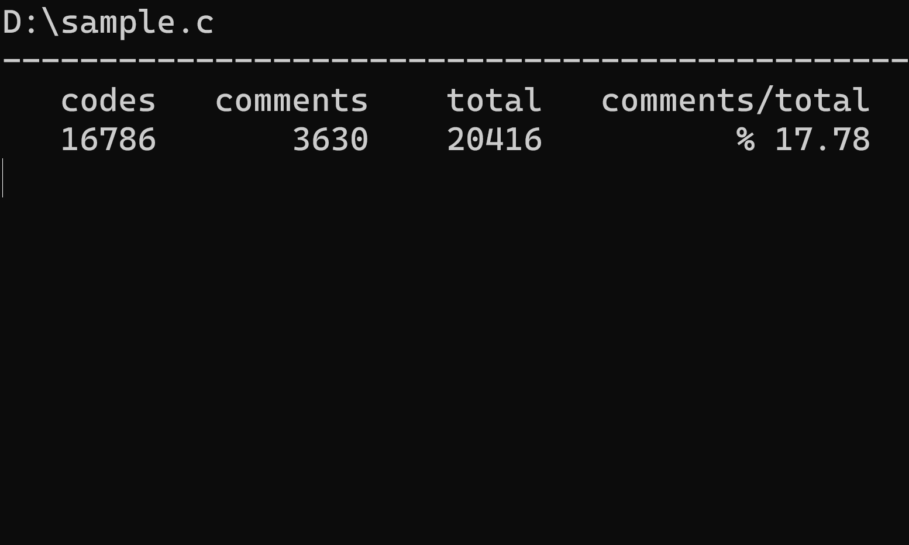

# Code Counter for C and C++
 Count the number of characters for comments and valid code in your source file
## How to use
Drag your source file to the CodeCounter.exe  
or run "CodeCounter \<filepath\>"
## Example

